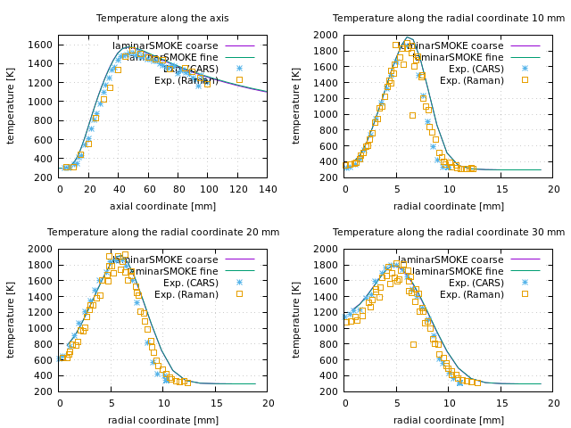
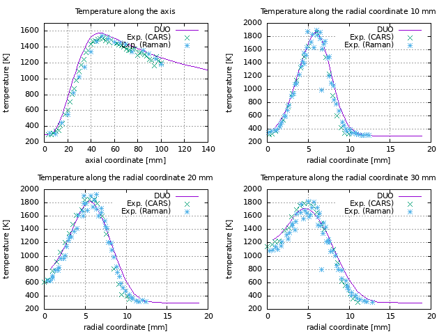
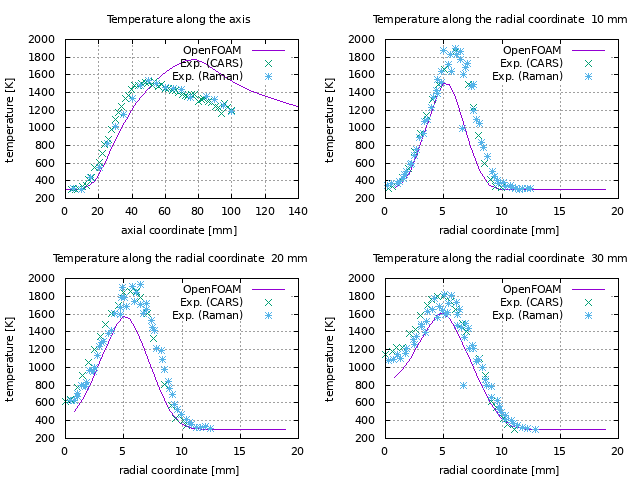

# Reactive Flow Using OpenFoam 

By Eric Daymo (eadaymo@tonkomo.com), Domenico Lahaye (d.j.p.lahaye@tudelft.nl) and helping friends.  

##  Section 1: Introduction 

Welcome to this course on simulating laminar and turbulent reactive flows using OpenFoam. Field of application is wide and needs to be described further (more).  

## Section 2: Course Description 
A detailed course description can be found at [course-description](course-description/course-description.ipynb).  

## Section 3: Geometry Definition and Mesh Generation

The goal of this section is to provide a uniform description of geometry definition and mesh generation for all the tutorial cases used in this course. We favor the use of the open domain variant of cfMesh. We intend to provide scripts allowing to generate a coarse, intermediate and fine mesh. We will assume course participants to be sufficient familiar with geometry definition and mesh generation to be able to make informed use of the scripts that we provide. We intend to provide pointers on the mesh generation. 

## Section 4: OpenFoam Solvers for Reactive Flow 

### Section 1.4: reactive flow solvers in OpenFoam 
 
### Section 2.4: reactingFoam for (non-)premixed combustion 

#### Physics solved for
Conservation of mass (pEqn.H), momentum (UEqn.H) and energy or enthalpy (EEqn.h), closed by equation of state (mixture ideal gasses). Add radiative or conjugate heat transfer, or both; 

ESI solver [description](https://develop.openfoam.com/Development/openfoam/-/blob/master/applications/solvers/combustion/reactingFoam/reactingFoam.C)

Add here conservation equations and boundary conditions. 

Add here description on how to add radiative heat transfer (sink term in energy equation plus conservation equations on how to solve transport equations to find this sink term). Information on Favre averaging of the radiative heat transport equations remains limited.   

Add here description on how to add conjugate heat transfer (mesh, solid and fluid domain, physics ion fluid and solid domain coupled by interface condition). 

#### Numerics used 

Pressure-based segregated solver. Pressure equation modified to take compressibility into account. Thermodynamics is based on compressibility psi (unclear how psiThermo affects overall computations). See book Moukalled e.a. for details. 

<b>Stationary Case</b> 

\begin{verbatim}
fvScalarMatrix pEqn // pEqn for incompressible stationary simpleFoam (recap)
(
  fvm::laplacian(rAtU(), p) == fvc::div(phiHbyA)
);
\end{verbatim}

\begin{verbatim}
fvScalarMatrix pEqn // pEqn for compressible stationary rhoSimpleFoam 
(
  fvm::laplacian(rhorAUf, p) - fvm::div(phid, p) == fvc::div(phiHbyA) 
);
\end{verbatim}

<b>Transient Case</b>

In the incompressible case, the mass convervation equation does not change. The pEqn therefore changes neither. This is confirmed by the code below. 

\begin{verbatim}
fvScalarMatrix pEqn // pEqn for incompressible transient pimpleFoam - idem simpleFoam 
(
  fvm::laplacian(rAtU(), p) == fvc::div(phiHbyA)
);
\end{verbatim}

\begin{verbatim}
fvScalarMatrix pEqn // pEqn for compressible transient rhoPimpleFoam 
(
  fvm::laplacian(rAtU(), p) - fvm::div(phid, p) - psi*correction(fvm::ddt(p)) 
  == fvc::div(phiHbyA) + fvc::ddt(rho) 
);
\end{verbatim}

The term using correction() is explained in this [cfd-online post](https://www.cfd-online.com/Forums/openfoam-programming-development/152356-foam-correction-function.html).
 
<b>Linear algebra</b>   
Pressure matrix become non-symmetric due to compressibily term.  

Add references describing how local time stepping accelerates finding a steady-state solution. 

Add references (ask Salvatore) references describing how tabulation and chemistry reduction helps in accelerating computations. 

#### References 

Other references do exist, e.g. 
- [Yang, Zhao, Ge](https://www.sciencedirect.com/science/article/pii/S0045793019301847?casa_token=4hTEFLeA4lUAAAAA:2mW2O2cT1y9MdlqSqMCV6G0AEV40wQs-kc6q1NAqV-7N7YeFuyL4NcXuwvWpg_M596abzrD5Jw);


### Section 3.4: xiFoam for premixed combustion (not Domenico) 

ESI solver [description](https://develop.openfoam.com/Development/openfoam/-/blob/master/applications/solvers/combustion/XiFoam/XiFoam.C). 

### Section 4.4: chtMultiRegionFoam combustion and conjugate heat transfer

ESI solver [description](https://develop.openfoam.com/Development/openfoam/-/blob/master/applications/solvers/heatTransfer/chtMultiRegionFoam/chtMultiRegionFoam.C)

## Section 5: Large Scale Computations 

- discretization settings for YEqn (fvSchemes): draw parallels between YEqn and kEqn-epsEqn for turbulence in terms of discretization;
- linear solver settings (fvSolutions): pressure matrix no longer symmetric in case Mach number exceeds 0.5;
- provide Allrun scripts for parallel decomposition of the case on various number of processors;  

## Section 6: OpenFoam Case Setup Description 
Goal: explain case set-up by explaining dictionaries in 0-dir/files, system-dir/files and constant-dir/files. In particular 

### Section 1.6: General Solver 

### Section 2.6: reactingFoam case-dir/constant-dir  

1. turbulenceProperties: see e.g. [Turbulence](https://www.openfoam.com/documentation/guides/latest/doc/guide-turbulence.html#sec-turbulence-usage) and other sources; 

2. physicalProperties (formerly thermophysicalProperties): see e.g. [Heat transfer](https://www.openfoam.com/documentation/guides/latest/doc/guide-heat-transfer.html#sec-heat-transfer-usage) and other sources; 

3. thermo.compressibleGasGRI

4. radiationProperties: no good reference see. See [Radiation](https://www.openfoam.com/documentation/guides/latest/doc/guide-heat-transfer.html)

5. boundaryRadiationProperties

6. chemistryProperties: describe [chemkinToFoam](https://github.com/OpenFOAM/OpenFOAM-11/blob/master/applications/utilities/thermophysical/chemkinToFoam/chemkinToFoam.C) and suggest cfd-online forum for trouble shooting;   

7. reactionsGRI

8. combustionProperties

9. momentumTransport: allows Le <>1 and/or Sc <>1. No documentation aside from H-file; (or use Cantera/CoolProp/Duochem to compute coefficients); [example file](https://github.com/OpenFOAM/OpenFOAM-11/blob/master/tutorials/multicomponentFluid/SandiaD_LTS/constant/momentumTransport); 

#### Specifying Le<>1 in physicalProperties (or thermophysicalProperties?)
\begin{verbatim}

    RAS
    {
        model           FickianEddyDiffusivity;
 
        mixtureDiffusionCoefficients yes;
 
        Prt             0.85;
        Sct             0.7;
 
        Dm // [m^2/s]
        {
            O2 6.64443705E-05;
            H2 4.22575501E-04;
            N2 4.74274421E-05;
        }
 
    }
\end{verbatim}

### Section 2.6: reactingFoam case-dir/system-dir

Explain relevant parts of fvSolution (solvers.Yi{} and PIMPLE{Yref{}})  and of fvSchemes (divSchemes.div(phi,Yi) and divSchemes.div(phi,K)). Refer to other courses for parts not explained here. 

### Section 3.6: reactingFoam case-dir/0-dir 

Explain Ydefault and species-name. 

### Section 4.6: chtMultiregionFoam Setup 

As above, seperately for fluid and solid domain. 

## Section 7: Laminar (non-premixed? hydrogen) ToroFlames:
See [laminarSMOKE](https://github.com/acuoci/laminarSMOKE) and 
[ToroFlames/F3](https://github.com/acuoci/laminarSMOKE/tree/master/run/validation/ToroFlames/F3) 

Validation by Eric using DUO. According to Eric, results are sensitive to solver settings.  

<div>

<center> Figure 1: Results obtain using laminarSMOKE.   
    </center>
</div>

<div>

<center> Figure 2: Results obtain using DUO.   
    </center>
</div>

<div>

<center> Figure 3: Results obtain using chtMultiregionFoam.   
    </center>
</div> 


## Section 8: Turbulent Small-Scale Non-Premixed Combustion: SandiaD test case 

### Section 1.8: Source 
[TNF Workshop](https://tnfworkshop.org/data-archives/pilotedjet/ch4-air/)

<b>Eric</b>: when I tried to lookup the experimental data online, I cannot find the centerline data file, but I have one in my files (DCL-Yfav.csv). When I search the internet for DCL-Yfav I cannot find this file, nor is it in the archives. Does Marco have this data? 

### Section 2.8: Test case description 
1. describe the case: non-premixed combustion using CH4; jet-flame pilot-burner stabilized; reference results from measurements of TNF workshop and from literature; 
2. transient solution to reach steady state; 
3. geometry definition, mesh generation and mesh check;
4. describe patch settings: inlet, outlet, walls, symmetry settings;  
5. running the non-reactive and reactive case; (with and without LTS, with and without tabulation and chemistry reduction); 
6. post-processing results and residual; 

### Section 3.8: Exercises 

1. compare runs with one-step chemistry, two-step chemistry, various forms of four-step chemistry, GRI-2.0 and GRI-3.0;
2. compare thermal NO post-processing with NO computed from chemical mechanism; 
3. compare runs with and without local time stepping (LTS); is this reported in the literature? 
4. compare runs with and without TDAC chemistry tabulation and reduction: literature? 
5. compare various wall temperature boundary conditions (insulating, radiating); 
6. compare runs on various meshes using remap from coarse to fine mesh; 
7. mixture fraction computation using function object; 
8. runs with adaptive mesh refinement (and load balancing)? 
9. extend to (D)DES and LES; 
10. extend to other flames (SandiaE and SandiaF) in TNF workshop series; 

### Section 4.8: Reference results
1. [report](./tutorial-cases/case-sandia-flamed/borujeni-norouzi-SandiaD-reactingFoam.pdf) by Borujeni and Norouzi; 
2. [report](./tutorial-cases/case-sandia-flamed/talice-SandiaD-reactingFoam.pdf) by Marco Talice using ESI v1906; 
3. [paper](http://web.stanford.edu/group/pitsch/publication/PitschPhysFluids_12_2000.pdf) by Pitsch and Steiner using LES and Lagrangian Flamelet Model; 
4. [paper](https://pubs.acs.org/doi/pdf/10.1021/acs.energyfuels.8b01001) Li e.a. on TDAC 
5. [video](https://www.linkedin.com/posts/senecal_cfd-convergecfd-combustion-activity-7069670018053013504-KFcJ/?utm_source=share&utm_medium=member_desktop%20\) ConvergeCFD simulation using LES anmd detailed chemistry;  

## Section 9: Turbulent Large-Scale Non-Premixed Combustion: DLR test case 

[DLRCJH](https://develop.openfoam.com/committees/hpc/-/tree/develop/combustion/XiFoam/DLRCJH) 

Premixed combustion using XiFoam. 

What is the Mach number? Can test case be solved using rhoThermo? Is the resulting pressure matrix symmetric? Can the p-solve be done using GAMG? Can the pressure-velocity coupled solver be used?  

## Section 8: Turbulent Non-Premixed Combustion with Heat Transfer to Solid: reverseBurner test case 

[OF11](https://github.com/OpenFOAM/OpenFOAM-11/tree/master/tutorials/multiRegion/CHT/reverseBurner)

[our reverseBurner](https://mega.nz/fm/LJd1XQoS)

## Section 9: Closing Remarks 
This is the end.  


```julia

```
