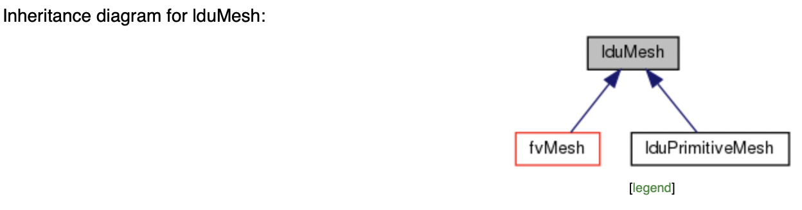

# OpenFoam for Turbulent Reactive Flow

## Section 1:/ Motivation for these Notes 
- develop backbone for lectures and further research on turbulent reactive flows with emphasis on (non, partially)-premixed (laminar,turbulent) combustion using OpenFOAM;
- develop model for turbulence, chemistry and radiation in the freeboard coupled with heat conduction in the lining through a conjugate heat transfer model;
- develop understand of OpenFOAM code separated into source code and application ; 

## Section 2:/ Introduction 
- OpenFOAM: cell-centered finite volume method on unstructured 3D grids; 
- object oriented in C++ using templates: definition in header file, implementation in corresponding C-file (could give example here); 
- parallel by mesh decomposition and parallel vector, matrix and solver architecture; 
- examples: mesh = object + operations (check on consistency, non-orthogonality), vector, matrix, ODE solver; 
- class (primitive mesh: mesh and operations on the mesh: which ones?) and superclass (polymesh: definition of patches and operations on patches: which ones?); 
- question: what kind of volumetric and surface patches can OpenFoam represent? 
- tensor calculus: templated classes to support tensors with various types of entries (integer, real or complex); 
- fvc and fvm: calculus (explicit) and method (implicit); using namespaces; attempt to keep operators diagonally dominant (beware of the initial values used to initialize non-linear iterations); all operators in either implicit and explicit versions; 
- Rhie-Chow interpolation to suppress spurious oscillations in the pressure field (outer corrections);
- OpenFOAM distribution divided into source and application; 

### Books

### Papers 

### Videos 
- [Pressure-Based Coupled Solver](https://www.youtube.com/watch?v=Jegzlfp4Ue8) by Adrian Winshurt 

## Section 3: Not in these Notes - Disclaimer 
- advanced turbulence models (no (Improved Delayed) Detached Eddy Simulation ((ID)DES), LES or more complex); 
- advanced chemistry models (infinitely fast chemistry only); 
- radiative heat transfer beyond grey models; 
- tabulated chemistry and flamelet models for combustion models; 
- 2020 annual review paper on LES: https://www.annualreviews.org/doi/full/10.1146/annurev-fluid-060420-023735#_i49  

## Section 4: OpenFoam Code
- fvCFH.H: main include file;
- object registry: you can think of an objectRegistry as being a database for holding objects (objects of type regIOobject to be specific). Since the objectRegistry itself is derived from a regIOobject, an objectRegistry can thus contain other object registries, and can potentially have a parent registry as well. Time is a special case of an objectRegistry that is also used to define the time coordination for multiple registries. It probably helps to think in terms of a file-system. The objectRegistry is analogous to a directory, the regIOobject is analogous to a file/directory. See also [what-object-registry Gerhard Holzinger 2021](https://www.cfd-online.com/Forums/openfoam-programming-development/236671-what-object-registry-openfoam.html#post805770) and [openfoam wiki](https://openfoamwiki.net/index.php/OpenFOAM_guide/objectRegistry) 
- examples of lookupObject include the examples below; 
const volScalarField& nut = mesh_.lookupObject<volScalarField>("nut");
const volScalarField& alphat = mesh_.lookupObject<volScalarField>("alphat");
const volScalarField& T = mesh_.lookupObject<volScalarField>("T");
- autoPtr and tmp: smart pointers: resource acquisition is initialization : if I wrap my newly allocated piece of data in a proper class with a destructor, it will get cleaned up automatically, as soon as the destructor of this class is called: [understanding-autoptr tomislav_maric 2012](https://www.cfd-online.com/Forums/openfoam-programming-development/104220-understanding-autoptr.html) and [tmp OpenFoam wiki](https://openfoamwiki.net/index.php/OpenFOAM_guide/tmp); 

## Section 5: Install, compile, link, run and debug OpenFOAM 
- foam-extend [website](https://sourceforge.net/projects/foam-extend/)
- install of ESI version on Linux: using either spack, singularity or apt-get on Ubuntu: [forum](https://www.cfd-online.com/Forums/openfoam-installation/)  
- wmake and wmake on part of the src or application: wmake libso thermophysicalModels/specie 
- OpenFOAM Wiki Guide: http://openfoamwiki.net/index.php/OpenFOAM_guide 
- CFD Direct OpenFOAM Users Guide: https://cfd.direct/openfoam/user-guide/ 
- CFD Direct OpenFOAM Linux guide: https://cfd.direct/openfoam/linux-guide/ 
- ESI OpenFOAM Users Guide: https://www.openfoam.com/documentation/guides/latest/doc/index.html including a section on post-processing https://www.openfoam.com/documentation/guides/latest/doc/openfoam-guide-post-processing.html 
- ESI OpenFOAM Tutorial Guide: https://www.openfoam.com/documentation/tutorial-guide/introduction.php 
- Foundation OpenFOAM Foundation C++ Guide: https://cpp.openfoam.org/v8/namespaceFoam.html (handy for inheritance diagrams)
- gdbOF https://openfoamwiki.net/index.php/Contrib_gdbOF  
- foamListTime  -rm (see documentation)
- options to be used during runtime: extensive config file available to from OPEN_FOAM_PATH/1806/etc/controlDict (need to check). This controlDict can be copied to HOME/.OpenFOAM/1806. Change solver performance from 1 to 2 to obtain more verbosity in the solver.

### UnnamedMoose Tutorials 
[UnnamedMoose Tutorials](https://github.com/UnnamedMoose/BasicOpenFOAMProgrammingTutorials)

### OpenFoam and Combustion Simulation Webinar 
[OpenFoam and Combustion Simulation Webinar](https://www.youtube.com/channel/UCpLKWwk4KhW-IFurD4SVtGw) 

### Parametric Studies 
- parametric studies using parametric studies [PyFoam](https://openfoamwiki.net/index.php/Contrib/PyFoam#Parameter_Variation);  

### Parallel Runs
- parallel processing using decomposePar (by a simple decomposition or by calling a mesh decomposition package) and reconstructPar;
- what posssibly goes wrong in very large models: https://github.com/conda-forge/mpi4py-feedstock/issues/15 
see https://www.cfd-online.com/Forums/openfoam-solving/232470-cleaning-out-timesteps-processor-directories.html 
I would not delete `processor*` directories if you do not change the mesh.

- If you want to replace the `processor*/0` directory from the new `0.orig` directory:
-- `rm -rf processor*/<time> && restore0Dir -processor`
-- You need to source `/bin/tools/RunFunctions` to use `restore0Dir`.
- If you want to decompose fields only, and not the existing mesh:
-- `decomposePar -fields`
- If you want to perform decompositions in parallel:
-- `mpirun -np X redistributePar -decompose -parallel`


## Section 6: Mesh Generation and Handling
- Mesh Description on ESI Users Guide: [mesh description](https://www.openfoam.com/documentation/user-guide/mesh-description.php#x11-300004.1.1)
- mesh hierarchy: [Passalacqua-Sing Report](http://www.tfd.chalmers.se/~hani/kurser/OS_CFD_2008/primitiveMeshDraftVersion.pdf); 
- geometric Field as Member data of the Mesh object: [GeometricField -> mesh() Function](https://www.cfd-online.com/Forums/openfoam-programming-development/223221-geometricfield-mesh-function.html); 
- primitiveMesh: cell-face mesh analysis engine: https://github.com/OpenFOAM/OpenFOAM-dev/blob/3db8158b7b90c204f1c33f3bb458cbf73a5585ff/src/OpenFOAM/meshes/primitiveMesh/primitiveMesh.H 
`a
- polyMesh: mesh consisting of general polyhedral cells: https://github.com/OpenFOAM/OpenFOAM-dev/blob/3db8158b7b90c204f1c33f3bb458cbf73a5585ff/src/OpenFOAM/meshes/polyMesh/polyMesh.H 

- lduMesh: provides LDU addressing: https://github.com/OpenFOAM/OpenFOAM-dev/blob/3db8158b7b90c204f1c33f3bb458cbf73a5585ff/src/OpenFOAM/meshes/lduMesh/lduMesh.H  

- fvMesh: mesh data needed to do the Finite Volume discretisation: https://github.com/OpenFOAM/OpenFOAM-dev/blob/3db8158b7b90c204f1c33f3bb458cbf73a5585ff/src/finiteVolume/fvMesh/fvMesh.H 
- the fvPatch class has a method delta() which returns the cell-centre to the face-centre vector. One can get the magnitude of those vectors to get the distance to the nearest wall and compute an estimate for y+; 
- conservative interpolation between meshes; 
- multiple region and processors interconnected by interfaces;  
- mesh conversion from other sources; 
- format used by Metis to decompose the mesh; 

### Section 6.1: Mesh Generation using blockMesh 

### Section 6.2: Mesh Generation using classyBlocks 
- see https://github.com/damogranlabs/classy_blocks ; nice for sufficiently low requirements; 


### Section 6.3: Mesh Generation using cfMesh 
run cartesianMesh with dictionary provided in system/meshDict for only the gas domain

### Section 6.4: Mesh Manipulation 
- list of all mesh manipulation utilities: https://openfoamwiki.net/index.php/Category:Mesh_manipulation_utilities 
- splitRegion: splits mesh into multiple regions: https://openfoamwiki.net/index.php/SplitMeshRegions  
- createBaffles: makes internal faces into boundary faces: https://openfoamwiki.net/index.php/CreateBaffles 
- mesh.findCell(position): find a cell by its coordinates;
- mesh.findNearestFace(position): find a face by its coordinates;
- mesh.findNearestBoundaryFace(position): as above for boundary faces;
- topoSet utility: way to select sets of cells and faces in code; 
- exercise: checkMesh and wallDistance; 

## Section 7: Post Processing 

### Settings in system/controlDict 
writeControl in case that variable time step is used; Talice uses writeControl adjustable: need to look into manual what this means;

### Function Object 
function objects for post-processing: https://www.openfoam.com/documentation/guides/latest/doc/openfoam-guide-post-processing.html 

computing averages of fields: https://www.openfoam.com/documentation/guides/latest/doc/guide-fos-field-field-average.html 

probe plots: https://cfd.direct/openfoam/user-guide/v8-graphs-monitoring/#x33-2680006.3 and 
https://www.youtube.com/watch?v=w_CPMRykzJM&feature=youtu.be&fbclid=IwAR0ZdYZGNKVC2lbCQkXdPs1W7YHj2Iu6bQQopElewuQiIeGhTf107mhiRQw 

yPlus: simpleFoam -postProcess -latestTime -func yPlus

Mach number: using -postProcess -func "MachNo(U)” or force a function  object to be executed via settings in system/controlDict and system/MachNo. Implementation  is in https://github.com/OpenFOAM/OpenFOAM-6/blob/master/src/functionObjects/field/MachNo/MachNo.H writes a volScalarField that represents the Mach number; 

wall heat flux: as before, writes a wallHeatFlux that can be visualized in Paraview: make volumetric plots of the wallheat flux. This will lower the value of the heat flux due to interpolation with zero values on the boundary. Later you can modify the plot to visualize on patches only.  

Q-criterium 
https://www.cfd-online.com/Forums/openfoam-solving/232098-order-execution-post-processing-functions.html 

### Paraview and Python for Paraview 
Paraview: Hakan Nillson ParaFoam tutorial: 
- part 1/4 https://www.youtube.com/watch?v=DzvKRA0XNhU
- part 2/4 https://www.youtube.com/watch?v=KthXYQ-6VUw 
- part 3/4 https://www.youtube.com/watch?v=CyA_Y_fnKgM 
- part 4/4 https://www.youtube.com/watch?v=EUJkNTQqWZE 

pyFoam: slides Gschaider 11th OpenFoam Workshop on Portugal

pickled format in Python (used in connection with pyFoam): https://pythontips.com/2013/08/02/what-is-pickle-in-python/ 

basic information on Python for Paraview: https://www.paraview.org/Wiki/ParaView_and_Python 
more detailed information on Python for Paraview: https://www.paraview.org/Wiki/ParaView/Python_Scripting To run Python for Paraview *outside* of the ParaView GUI, please use pvpython (pvpython.exe on Windows). This executable is part of ParaView installation.  

### Residual Norm Plotting 
foamLog and foamMonitor: see tutorial https://www.youtube.com/watch?v=ZWEaMNPZpYI&feature=share&fbclid=IwAR3k9wGz23r6BKWEadXexVGQWDQD51tiVV3rlf-IAJi1bbae_blwhAxYjzc  

Plotting the residual norm of various fields vs. iteration number  
write residual norms of the various fields to file instead of to screen. Do so using so-called unix pipe command, e.g., simpleFoam >& log.simpleFoam or use the runApplication utility instead (typically inside of Allrun);  
use foamLog utility to generate the the logs-directory in the case directory; foamLog runs a bunch of scripting commands to read data from the log-file and reorders the information in separate files; 
use gnuplot to load and plot the data in the logs-directory: in separate terminal run ./myplot. See sample myplot file below 

Sample myplot file to plot residual norm  vs. iteration number 
#!/bin/bash

Requires running foamLog <log-file> first!!

gnuplot -persist >/dev/null 2>&2 << EOF 
   set logscale y 
   plot "logs/UxFinalRes_0" with lines, \
        "logs/UyFinalRes_0" with lines, \
        "logs/UzFinalRes_0" with lines, \
        "logs/pFinalRes_0" with lines, \
        "logs/kFinalRes_0" with lines,  \
        "logs/epsilonFinalRes_0" with lines 

### Residual Field Plotting 

#### Changes to be made in the system directory 

1.1/ In system-folder/controlDict-file 

… 
writeInterval   10;
…

functions
{
   #includeFunc residualFieldDict
}

#### In system-folder/residualFieldDict-file  

type            solverInfo; // specific for version-1906 
libs            ("libutilityFunctionObjects.so");

writeControl    runTime; // timeStep;
writeInterval   10; // make sure this to be equal as the writeInterval specified in the controlDict file 

writeResidualFields yes; 

fields (".*"); // 
 
#### Remarks  

How to make sure that writeInterval in system-folder/controlDict-file and system-folder/residualFieldDict-file

#### References 

in OpenFoam.com: using solverInfo: https://develop.openfoam.com/Development/openfoam/blob/master/src/functionObjects/utilities/solverInfo/solverInfo.H 
residual.cfg: https://develop.openfoam.com/Development/openfoam/blob/master/etc/caseDicts/postProcessing/numerical/residuals.cfg 


Producing plots as *.png file while the solver is running (no graphical terminal required)
process in two stages 
in Stage1: write data to file as solver is running by extending the functions dictionary in the controlDict file; 
in Stage2: produce *.png files from the data (without required graphical terminal)
the trick is to produce *.png files from data written to file without requiring a terminal with graphical capabilities; 
above can be extended for probes and surface plots; 
for more information and examples, see https://cfd.direct/openfoam/user-guide/v6-graphs-monitoring/ 

Stage1: Write data to file at values-of-time-instances-for-which-you-would-like-to-see-the-graphs 
in system-folder/controldict-file, include the line 
functions
{ 
   .. // other functions 
    #includeFunc singleGraph_1 
    #includeFunc singleGraph_2
    #includeFunc singleGraph_3 

} 
Here singleGraph_1, singleGraph_2 and singleGraph_3 (and possibly other) are files in system-folder/. Each of these files has the outline given below 

/*--------------------------------*- C++ -*----------------------------------*\
  =========                 |
  \\      /  F ield         | OpenFOAM: The Open Source CFD Toolbox
|  \\    /   O peration     | Version:  v1806                                 |  
|   \\  /    A nd           | Web:      www.OpenFOAM.com                      |
     \\/     M anipulation  |
-------------------------------------------------------------------------------
Description
    Writes graph data for specified fields along a line, specified by start
    and end points.

\*---------------------------------------------------------------------------*/

start   (0 2.7001 0); // start coordinate in xyz-space 
end     (0 40 0); // end coordinate in xyzzy-space 
fields  (U k epsilon T p); // fields to plot 
region gas; // region to sample 

// Sampling and I/O settings
#includeEtc "caseDicts/postProcessing/graphs/sampleDict.cfg"

// Override settings here, e.g.
// setConfig { type midPoint; }

// Must be last entry
#includeEtc "caseDicts/postProcessing/graphs/graph.cfg"

// ************************************************************************* //

Running the solver with this setting will produce files of the form 
case-folder/postProcessing/singleGraph_1/region/time-stamp/line<field-name>.xy 
 
Stage 2: Use Gnuplot in batch mode to create *.png file from the data at values-of-time-instances-for-which-you-would-like-to-see-the-graphs  
run gnuplot in batch mode using the gnuplot_export script  
the gnuplot_export script takes data from postprocessing subfolder and writes the figure as *.png file into the gnuplot_expo folder. Make sure to clean up the postprocessing folder before starting the simulations again;  
run “gnuplot -c gnuplot_export <values-of-time-instances-for-which-you-would-like-to-see-the-graphs>“. The option -c allows to run gnuplot in script mode. No interactive session is required with graphical output is required. 

Below is a sample gnuplot_export script 

reset
set xrange [*:*]
set yrange [*:*]
set term png size 1305,900
set output 'gnuplot_export/singleGraph_1/Ux.png'
set style data linespoints
set lmargin 15
set bmargin 5
set xrange [0:37.3]
set tics font "Times,20"
set key font "Times,20"
set title "Ux" font "Times,20"
set ylabel 'Ux [m/s]' font "Times,20" offset -3,0
set xlabel 'y [m]' font "Times,20" offset 0,-0.5
set xtics ("2.7" 0, "5" 2.3, "10" 7.3, "15" 12.3, "20" 17.3, "25" 22.3, "30" 27.3, "35" 32.3, "40" 37.3) offset 0,-0.5
plot "postProcessing/singleGraph_1/gas/18000/line_U.xy" u 1:2 title "18000", "postProcessing/singleGraph_1/gas/17995/line_U.xy" u 1:2 title "17995", "postProcessing/singleGraph_1/gas/17000/line_U.xy" u 1:2 title "17000"

Ideally we would like the time stamp as run time option for these scripts. 

Averaging of there field quantities 
average the fields over the flame/jet has been developed (from iteration 2k or so onwards)

Plotting psi in OpenFoam 
in controlDict place 
{
  type writeRegisteredObject;
  functionObjectLibs ("libIOFunctionObjects.so");
  objectNames ("bananas");
  outputControl outputTime;
  outputInterval 1;
}
Here, "bananas" will give you the list of all registered object, replace by the one you want.
See https://www.cfd-online.com/Forums/openfoam-post-processing/100307-how-output-other-properties.html  


POD decomposition of the Flow Results
https://github.com/IllinoisRocstar/AccelerateCFD_CE 

Dynamic Mode Decomposition Function Object 
https://www.openfoam.com/news/main-news/openfoam-v20-06/post-processing 

What triggers function objects to be executed
https://www.cfd-online.com/Forums/openfoam-programming-development/144913-what-trigger-function-objects.html 


## Section 8: Linear Solvers 

Describe here: 

1. vectors (or fields): field, scalarField (good example of object oriented programming), vectorField, surfaceField, volField; operations on vectors and matrices with a parallel layout; 

2. operations on vectors (schemes)

3. matrices: lduMatrix and fvScalarMatrix; parallel assembly and parallel solve;

4. linear solvers; solving an equation typically involves going through there following four steps: 

a. define the equation with fvScalarMatrix as an output;
b. relax the equation (as oppposed to relaxing the field) by calling the relax member function of the class; The objectivite here is to put as much weight on the diagonal of the matrix as possible; 
c. apply the constraints by calling the constraint (or correct ?) member function (Dirichlet and Neumann boundary conditions);
d. solve the equations by calling the solve member function;   
  
definition of relax and correct as member functions of fvScalarMatrix are given in https://github.com/OpenFOAM/OpenFOAM-dev/blob/master/src/finiteVolume/fvMatrices/fvMatrix/fvMatrix.H 

linear system residual computation: https://www.cfd-online.com/Forums/openfoam-solving/95540-residuals-calculation.html

nice documentation of foamacademy.com: https://www.foamacademy.com/wp-content/uploads/2018/03/OF2018matrix.pdf 

### Relaxation 

- field vs. equation relaxation: https://www.cfd-online.com/Forums/openfoam-solving/196204-difference-between-fields-equations-relaxation-sub-directories-fvsolution.html

- Ansys-Fluent Theory Guide: [Underrelaxation of Fields vs. Underelaxation of Variables](https://www.afs.enea.it/project/neptunius/docs/fluent/html/th/node374.htm) including a discussion on the relation between CFL number and relaxation parameter; 

### AMGX 
1. CDF-Online dialogue: https://www.cfd-online.com/Forums/openfoam-programming-development/163162-has-any-one-tried-amgx-openfoam.html 

### PETSc4Foam 
1. video by Wolf Dynamics: https://www.youtube.com/watch?v=_TWYCwpRTlY 

## Section 9: ODE Solvers 
- list of available ODE solvers: https://www.openfoam.com/documentation/guides/latest/api/group__grpODESolvers.html 
- SIBS: semi-implicit mid-point solver for stiff systems of ordinary differential equations
- explicit RK solver 
- ISAT: tabulation 
- local time stepping: localEuler 
- setting for Courant (CFL) number: in controlDict set: adjustTimeStep  yes; and maxCo   0.25;
- stiff ODE solver (for chemistry) are provided by connecting OpenFoam and Cantera. Cantera has Sundials, and thus the stiff ODE integrator CVODE. See http://openfoamwiki.net/index.php/Contrib_alternateReactingFoam and https://www.cfd-online.com/Forums/openfoam-solving/64841-cantera.html for details; 
- ode solver: http://hassankassem.me/posts/ode/ 

## Section 10: Basic Solvers 
- [laplacianFOAM](https://github.com/OpenFOAM/OpenFOAM-dev/blob/master/applications/solvers/basic/laplacianFoam/laplacianFoam.C): stationary and transient diffusion; possibly variable diffusion coefficient; solves for T (volScalarField) with a diffusion coefficient DT (dimensionScalar); solve placed inside a SIMPLE loop; accuracy of the SIMPLE loop governed by the residual; the SIMPLE loop steers non-orthogonal corrections and checks the convergence; 

- [scalartransportFOAM](https://github.com/OpenFOAM/OpenFOAM-dev/blob/master/applications/solvers/basic/scalarTransportFoam/scalarTransportFoam.C): stationary and in stationary convection-diffusion; velocity field U read from file and thus given by a previous solve; as laplacianFOAM except for added convective term; 

- [potentialFOAM](https://github.com/OpenFOAM/OpenFOAM-dev/blob/master/applications/solvers/basic/potentialFoam/potentialFoam.C): potential flow solved for pressure potential Phi (volScalarField); reconstruct velocity U from the flux phi of the computed solution; better correspondence with analytical solution in case that orthogonal meshes are employed;

### Temporal Discretization 

- more details on the discretization of the time-derivative term (see Moukaled-Darwish);

- Euler: first order backward Euler; 

- backward: three-time-steps backward difference method; 

- CranckNicolson: modified Crank-Nicolson scheme where an off-center parameter with a value between 0 and 1 has been introduced to control the weight toward either standard Crank-Nicolson scheme or the implicit Euler scheme;

- bound on the time-step (maxDeltaT) and on the Courant number (maxCo). Both are set in the PIMPLE dictionary in the system/fvSolutions file. Courant number is governing the time step even though an implicit time-stepping method is choosen;   

- local time-stepping method; explained on [CFD-Online Local Time Stepping](https://www.cfd-online.com/Forums/openfoam-solving/225720-local-time-stepping-lts.html); Quote: compute "timesteps" for each cell based off a max courant number, smooth this timestep field (in space) to improve stability, and then damp this timestep field (in time, as in limit changes) to further improve stability: end quote. Smoothing is controlled by the parameters rDeltaTSmoothingCoeff and rDeltaTDampingCoeff set in the PIMPLE dictionary in the system/fvSolutions file; SLTS phi rho 1.0 in ddt (fvSchemes, details missing); 

- time integration for wave equation in OpenFoam: [paper On the use of Euler and Crank-Nicolson time-stepping schemes for seakeeping simulations in OpenFOAM](https://upcommons.upc.edu/bitstream/handle/2117/332090/Marine-2017-74_ON%20THE%20USE%20OF%20EULER.pdf)  

- second order time discretization: [paper Consistent second-order time-accurate non-iterative PISO-algorithm](https://doi.org/10.1016/j.compfluid.2018.01.041)  

### Spatial Discretization 

- more details on the discretization of the gradient, divergence and the Laplacian (see Moukaled-Darwish);

- spatial discretization scheme: linear interpolation for the pressure from the cell centers to the face separating the two cells: https://www.cfd-online.com/Forums/openfoam-programming-development/236834-face-pressure-interpolation-scheme-based-linear-interpolation.html 

- div-scheme settings: 

- grad-scheme Gauss linear: explained on [fvc-grad-only-gaussgrad](https://www.cfd-online.com/Forums/openfoam-programming-development/96661-fvc-grad-only-gaussgrad.html)

- [Courant blended divergence scheme](https://www.openfoam.com/documentation/guides/latest/doc/guide-schemes-divergence-coblended.html) and [blending factor](https://www.openfoam.com/documentation/guides/latest/doc/guide-fos-field-blendingFactor.html); in essence blends second order central differences (accurate, hard to convergence) and first order upwind (inaccurate, hard to convergence) scheme based on the CFL number.  

- example of blended scheme: Gauss CoBlended 1 LUST grad(U) 10 linearUpwind grad(U): uses the LUST (Linear Upwind Stabilized Transport) scheme (but any other scheme works here) in case that the local CFL number is <=1, uses linear upwind in case that local CFL number is >= 10 and uses a blend in between where the weight of the blend is the CFL number; 

- insightful paper [Evaluation of OpenFOAM’s discretization schemes used for the convective terms in the context of fire simulations](https://www.sciencedirect.com/science/article/pii/S0045793021003236?casa_token=OVioQM79WAMAAAAA:AukrUidmVfUWy4KLaVr5Yb6Y-5wr0FHEL2ZIMIsu9ouUfNHYm9DzKW5ftV2xdSIlbYpSaO83wA) discussing use of blended scheme; 

- .flux() is a public member function of the fvMatrix class; sample usage in psiEqn.flux(); phi = flux(U) where U is a volVectorField and phi is a surfaceScalarField; U is defined on the cell centers and that phi is defined on the face centers; 

- non-orthogonal corrections to treat non-orthogonal grids (see https://www.youtube.com/watch?v=Dg2PwX6yxYY  https://www.youtube.com/watch?v=yU7r8mYK3bs and Moukaled-Darwish); 

- non-orthogonal correction: viewed as a way to solve the discretized equations to sufficient accuracy; if important, then final residual of the previous run is significantly different from initial residual of current run; 

### Coded Sources and fvOptions  

- SuSp: automatic implicit/explicit treatment of non-linear source to facilitate the diagonal dominance of the matrix: SuSp will only put the the cells implicit with a negative sign. All others are treated explicitly: [fvmatrix fvoptions susp by zeppo 2021](https://www.cfd-online.com/Forums/openfoam-programming-development/182107-fvmatrix-fvoptions-susp-automatic-implicit-explicit-source-term-treatment.html)

- documentation: https://www.openfoam.com/documentation/guides/latest/doc/guide-fvoptions-sources-coded.html 
CFD Online: active yes vs. active true: https://www.cfd-online.com/Forums/openfoam-pre-processing/238265-coded-source-nerver-used.html#post822216 

- video linked below explains how to set up a codedFixedValue boundary condition for a parabolic inlet velocity profile: https://www.youtube.com/watch?v=3zcT...el=HyperLyceum

- use a .csv file as input for a fixedValue boundary condition. https://www.youtube.com/watch?v=rfNY...nicalModelling 

- good example of codedSoure: https://www.cfd-online.com/Forums/openfoam-solving/241695-codefixedvalue-define-use-function-code-block.html 

- more broadly the use of codedFixedValue: https://www.youtube.com/watch?v=cvWa...el=HolzmannCFD 
examples of codedFixedValue to define the boundary conditions: https://www.cfd-online.com/Forums/openfoam-programming-development/242813-how-solve-linear-equations-codedfixedvalue-boundary.html#post828375  

- fvOptions on sourceflux website: http://sourceflux.de/blog/software-design-fvoptions/ 

- fvOptions on caefn website: https://caefn.com/openfoam/fvoptions 

- fvOptions via cdd-online: https://www.cfd-online.com/Forums/openfoam-solving/196864-adding-temperature-dependent-heat-source-using-fvoptions-chtmultiregionsimplefoam.html 

in the file fvOptions options
{
    energySource
    {
        type            scalarSemiImplicitSource;

        timeStart       0.2;
        duration        0.3;
        selectionMode   cellSet;
        cellSet         ignition;
        volumeMode      specific;

        injectionRateSuSp
        {
            h          (2e7 0); // kg/m/s^3
        }
    }

## Section 11: Boundary Conditions 

general information on boundary conditions: https://www.openfoam.com/documentation/guides/latest/doc/openfoam-guide-boundary-conditions.html and https://www.cfd-online.com/Forums/openfoam-solving/88762-updating-boundary-conditions-each-iteration.html 

difference between imposed and calculated boundary conditions. Imposed boundary conditions remain fixed throughout computations. Calculated boundary conditions maybe be updated throughout computations. Example is the computations of nut on the boundary depending on k and eps values. Imposed fixed (as opposed to calculated) conditions on density proved to be essential to reach convergence in both the rotary kiln and anode baking case;

valuable discussiion updateCoeff() and evaluate(): https://www.cfd-online.com/Forums/openfoam-programming-development/123913-updatecoeffs-evaluate.html 

use of “value” in some boundary conditions: https://www.cfd-online.com/Forums/openfoam-pre-processing/234124-clarification-k-omega-settings.html 

### Inlet Boundary Conditions 
k: turbulentIntensityKineticEnergyInlet: boundary condition for turbulent kinetic energy on an inlet patch: for details, see https://www.openfoam.com/documentation/guides/latest/doc/guide-bcs-inlet-turbulent-k-turbulent-intensity-kinetic-energy.html 

inlet condition for k requires a turbulent intensity: typically set to 0.05 or 5 percent; 

epsilon: turbulentMixingLengthDissipationRateInlet: for details, see https://www.openfoam.com/documentation/guides/latest/doc/guide-bcs-inlet-turbulent-epsilon-turbulent-mixing-length-dissipation-rate.html 

inlet condition for epsilon requires a turbulent length scale; typically set to 0.038 times the hydraulic parameter; 
hydraulic parameter is defined as 4 * area / perimeter: see https://en.wikipedia.org/wiki/Hydraulic_diameter 

### Outlet Boundary Conditions 
for both k and epsilon: inletOutletConditions: prevents reverse flow on a boundary patch. See https://www.cfd-online.com/Forums/openfoam-solving/60337-questions-about-inletoutlet-outletinlet-boundary-conditions.html 

### Wall Boundary Conditions 
for k: kqRWallFunction with value same as initial value specified by internalField 

for epsilon: epsilonWallFunction 
interesting discussion of implementation of wall functions in OpenFoam: Item #6 in https://www.cfd-online.com/Forums/openfoam-solving/229743-les-simulation-wall-modeling.html 

### Wave Transmissive Conditions 
wave transmissive boundary conditions: from the users guide https://www.openfoam.com/documentation/guides/latest/api/waveTransmissiveFvPatchField_8H_source.html or https://openfoamwiki.net/index.php/HowTo_Using_the_WaveTransmissive_Boundary_condition (confusing to read)

## Section 12: Transport Models 

Example of a small class, private and public data members, private and public member functions. 

## Section 13: Thermodynamical Models 
internal energy e, kinetic energy K and enthalpy h
thermo dynamics library (JANAF, polynomial tables, possible time consuming to evaluate) based on rho or psi; 
equation for energy (internal energy or the enthalpy) EEqn; switch between e or h; see e.g. https://www.cfd-online.com/Forums/openfoam-solving/241020-hconst-econst.html 
definition of p = p_rgh + rho*gh;
static pressure, total pressure and isentropic pressure: https://www.openfoam.com/documentation/guides/latest/doc/guide-fos-field-pressure.html 
rhoSimpleFoam does not allow to the source terms of chemistry and radiation into account; 
computing temperature from internal sensible enthalpy: https://www.cfd-online.com/Forums/openfoam-programming-development/216577-temperature-calculation-sensible-internal-energy.html 
compressibility: psi = \partial \rho / \partial p (change of density due to pressure variations): barotropic relationship 
thermodynamics class: https://wiki.openfoam.com/Thermodynamic_class_by_Isabelle_Choquet 

### Thermophysical properties 
constant-folder/thermophysicalTransport-file: example of cavity for rhoPimpleFoam: https://github.com/OpenFOAM/OpenFOAM-8/blob/master/tutorials/compressible/rhoPimpleFoam/RAS/cavity/constant/thermophysicalTransport 
example: set non-unit Lewis number:  
       LES
      {
          model         nonUnityLewisEddyDiffusivity;
          Prt             0.85;
          Sct             0.7;
      }

### Thermodynamics in function of rho (density) or in terms of psi (compressibility)

<b>RhoThermo</b>: thermo.rho() returns a stored rho field that is calculated from pressure and temperature fields according to the selected thermophysical model in thermo.correct();
rhothermo: basic thermodynamic properties based on density; for fluids with low compressibility like water where the density change is mostly due to temperature variation; huge pressure jumps will not be represented correctly; solvers using rhothermo (like the buoyant solvers) use a simplified pressure equation where psi is accounted for explicitly; 

Code for pEqn (as used for instance in heattransfer/buoyantPimpleFoam)
 
$$
fvc::ddt(rho) + psi*correction(fvm::ddt(p_rgh)) + fvc::div(phiHbyA) - fvm::laplacian(rAUf, p_rgh)
==
fvOptions(psi, p_rgh, rho.name())
$$


<b>PsiThermo</b>: basic thermodynamic properties based on compressibility; for gas; combustion solvers and transsonic solvers use the psithermo model. They have another pressure equation where the change in time of pressure is treated implicit by dit(psi, p); larger pressure jumps are now possible. Such solvers are used when the flow is mainly driven by pressure changes and temperature change is only an effect of large compression and expansion; 

Code for pEqn (as used for instance in combustion/reactingFoam)

$$
fvm::ddt(psi, p) + fvc::div(phiHbyA) - fvm::laplacian(rhorAUf, p)
==
fvOptions(psi, p, rho.name())
$$ 

note that alternatives above are essentially different in the ddt-terms. The code for pEqn in heat transfer/bouyantSimpleFoam contains 
         fvm::laplacian(rhorAUf, p_rgh) == fvc::div(phiHbyA)

rhoSimpleFoam now instantiates the lower-level fluidThermo which instantiates either a psiThermo or rhoThermo according to the 'type' specification in thermophysicalProperties. For details, see https://develop.openfoam.com/Development/OpenFOAM-plus/commit/655fc7874808927d14916307a2230a8965bdb860 

References: 
- OpenFOAM.com: OpenFOAM: https://www.openfoam.com/documentation/user-guide/thermophysical.php 
- CFD Direct: OpenFOAM: https://cfd.direct/openfoam/energy-equation/ 

### Implementation of the Thermodynamics: The case of hePsiThermo 

definition of the class: https://github.com/OpenFOAM/OpenFOAM-7/blob/109ba3c8d53a8fa1e97854b168a16970aaeea951/src/thermophysicalModels/basic/psiThermo/hePsiThermo.H: inherits from heThermo
public member data this->psi_
private member function calculate: called from public member function correct; loops over cells
public member function correct(): called from EEqn.H in solver; 

## Section 14: Turbulence Models 

wiki on turbulence modeling: https://en.wikipedia.org/wiki/Turbulence_modeling 

cfd-online on the realizable k-epsilon model: https://www.cfd-online.com/Wiki/Realisable_k-epsilon_model 

overview of turbulence models in OpenFoam (very nice): https://www.cfd-online.com/Forums/openfoam-solving/218879-latest-developed-turbulence-models.html 

overview on turbulence modeling by Wolf Dynamics: [slides](http://www.wolfdynamics.com/training/turbulence/OF2021/turbulence_2021_OF8.pdf)

boundary condition settings: https://www.openfoam.com/documentation/guides/latest/doc/guide-turbulence-ras-k-epsilon.html 

effect of compressibility on the turbulence modeling: [dilation dissipation](https://www.afs.enea.it/project/neptunius/docs/fluent/html/th/node63.htm);

References: [Fluent Manual Section 14](https://www.afs.enea.it/project/neptunius/docs/fluent/html/th/node42.htm) 

### Wall functions for k (turbulent kinetic energy), eps (turbulent dissipation), nut (turbulent kinematic viscostity) and T (temperature)

wall function for k in OpenFOAM: two options are available. (1/2 )A low Reynolds number in kLowReWallFunction and (2/2) an  alternative kqRWallFunction known to work for both low and high Reynolds numbers. Low or high Re is here to be intended actually in reference to the grid size, thus referring to the y+ of the near wall cells. Low Re means that the near wall cell is fine enough to give low y+ values (resolve all flow features at the wall, so that the linear interpolation is enough. High Re (or NON Low Re) means that the near wall cell is not fine enough to do the above (and the WF are needed). Low Reynolds is based on zero-gradient assumption used in master thesis Ali Kadar and Dimas Fikri. This is correct as both in the logarithmic region (y+ above 30 or so) and very close to the wall (k goes to 0 at wall with a larger than 1 power)): https://github.com/OpenFOAM/OpenFOAM-dev/tree/8ca408bf6c83999c71db180f5b2f306472f20b5c/src/TurbulenceModels/turbulenceModels/derivedFvPatchFields/wallFunctions/kqRWallFunctions/kLowReWallFunction The k wall function implements a zero-gradient boundary condition. The kqRWallFunction requires setting a value of k on the wall. In the Pitz-Daily test case this value is set equal to 0.375 m^2/s^2; this is based on an inlet/outle conditions; in case of outlet at the inlet, and fixed inlet value is set;  

wall function for epsilon in OpenFOAM: two options are available: see https://github.com/OpenFOAM/OpenFOAM-dev/tree/8ca408bf6c83999c71db180f5b2f306472f20b5c/src/TurbulenceModels/turbulenceModels/derivedFvPatchFields/wallFunctions/epsilonWallFunctions/epsilonWallFunction In the Pitz-Daily test case the epsilonWallFunction is choosen and the value equal to 14.855 m^2/s^3 is set as value on the boundary; 

wall function for nut (eight options, tabulated requires large coding effort leaving 7, two rough wall options not applicable leaving 5, Spalding is an all y+ wall function, while the remaining ones are piecewise valid. Based on the Pitz-Dally tutorial, we will use nutkwallfunction): https://github.com/OpenFOAM/OpenFOAM-dev/tree/8ca408bf6c83999c71db180f5b2f306472f20b5c/src/TurbulenceModels/turbulenceModels/derivedFvPatchFields/wallFunctions/nutWallFunctions The basic difference between nutUWallFunction and nutkWallfunction is the computation of y+. In nutkWallFunction it is computed from the turbulent kinetic energy and the constant c_mu, whereas in nutUWallFunction y+ is simply read in.

wall function for T (temperature) (two options of which only one uses the Jayatilleke model. We will use that one): https://github.com/OpenFOAM/OpenFOAM-dev/tree/8ca408bf6c83999c71db180f5b2f306472f20b5c/src/TurbulenceModels/compressible/turbulentFluidThermoModels/derivedFvPatchFields/wallFunctions/alphatWallFunctions 

general info on wall functions in OpenFOAM can be found here: https://github.com/OpenFOAM/OpenFOAM-dev/tree/8ca408bf6c83999c71db180f5b2f306472f20b5c/src/TurbulenceModels/turbulenceModels/derivedFvPatchFields/wallFunctions 

## Section 15: Incompressible Flow Solvers - Stationary Case 

### Section 1.15: Mathematical Model 

Stationary incompressible laminar or turbulent flow. See [Navier-Stokes equastions](https://en.wikipedia.org/wiki/Navier–Stokes_equations). 

### Section 2.15: Spatial Discretization, Non-Linear and Linear Solve 

SIMPLE iteration (repeated substitution for linearization (requires relaxation) and Schur complement for pressure-velocity solve): 
1. [wiki SIMPLE algorithm](https://en.wikipedia.org/wiki/SIMPLE_algorithm)
2. Chapter xx of Malaseekera and Versteeg 

### Section 3.15: Implementation in OpenFoam 

1. Chapter 15 of Darwish and Mangani 
2. [OpenFoamwiki SimpleFoam](http://openfoamwiki.net/index.php/SimpleFoam): incompressible solver for pressure (pEqn), velocity (UEqn) and turbulent quantities (kEqn and epsEqn) inside of runtime loop; one pressure andf one velociy solve per SIMPLE iteration 
[simpleFoam](https://github.com/OpenFOAM/OpenFOAM-dev/blob/master/applications/solvers/incompressible/simpleFoam/simpleFoam.C) 

pressure-velocity coupling in simpleFoam: Rhie-Chow interpolation (stable formulation that avoids checkerboarding): user has no immediate access to it: PhD thesis of Jassak: H-operator and report by Fabian Peng Karrholm at Chalmers: off-diagonal blocks in the pressure-velocity coupling; A-operator: diagonal blocks in the pressure-velocity coupling; https://www.cfd-online.com/Wiki/Velocity-pressure_coupling 

pressure in simpleFoam (pEqn): 
 - https://www.cfd-online.com/Forums/openfoam-solving/190173-pressure-openfoam.html 
 - solves for scaled (kinematic) pressure p/rho instead of static pressure p: https://www.cfd-online.com/Forums/openfoam/233423-what-unit-pressure-measured-openfoam.html

velocity in simpleFoam (UEqn): 
- adding source term in velocity equations: https://www.cfd-online.com/Forums/openfoam-solving/58956-adding-source-term-u-eq-2.html 

turbulent quantities model (kEqn) and (epsEqn): 
- source term turbulent quantity equations: https://www.cfd-online.com/Forums/openfoam-solving/176542-k-epsilon-implementation-including-volscalarfield-g.html  

## Section 16: Incompressible Flow Solvers - Transient Case 

PIMPLE iteration (SIMPLE and PISO combined): Chapter 15 of Moukalled-Darwish-Mangani: confusion between PRIME and SIMPLE algorithms 

[pimpleFoam](https://github.com/OpenFOAM/OpenFOAM-dev/blob/master/applications/solvers/incompressible/pimpleFoam/pimpleFoam.C): transient solver; both laminar and turbulent; outer runtime loop; one velocity solve in case that momentum predictor is set to true (default); number of correctors pressure solves;

[pisoFoam](https://github.com/OpenFOAM/OpenFOAM-dev/tree/master/applications/solvers/incompressible/pisoFoam): equal pimpleFoam with one (single) outer corrector; pimpleFoam can be run essentially as pisoFoam by setting nOuterCorrectors to 1. This alleviates any coding problem. pimpleFoam supports adjustable timestep. https://www.cfd-online.com/Forums/openfoam-solving/130436-using-adjustabletimestep-pisofoam.html

Does increasing the number of outer iterations aid in the converge by allowing a larger step (or in any other  way)? 

For the first part of the question - pimple or piso - well, since you are running LES, you'll be ensuring Co<1, probably Co~0.3. In which case you don't get any benefit from the additional pressure correctors that allow the pimple solver to stretch the Co number to 10 and beyond. So, you basically want to be running piso. - Having said that - you can run pimpleFoam in "piso mode" by just limiting nOuterCorrectors to 1 (ie one pimple iteration per time step) and nCorrectors to 2 (ie two inner loop pressure correctors). That will then give you access to the other features of the pimpleFoam solver. See https://www.cfd-online.com/Forums/openfoam-solving/233906-large-eddy-simulation-pisofoam-pimplefoam.html 
 
### momentumPredictor predictor setting inside of SIMPLE and PIMPLE 

what is the momentum correction? The momentum predictor is a first approximation of the velocity field obtained from the solution of a momentum equation assembled with the previous time-step pressure field. This velocity doesn't fulfill the restriction given by the continuity equation which is achieved later by the PISO method. Sometimes you can avoid the solution of the momPred saving time, but it can lead to a bad convergence in the PISO loop
setting equal yes (computationally expensive, more stable in convergence): in general momentumPredictor should be set to no, especially for "challenging" test cases (i.e if there is problems with convergence or sharp volume fraction gradient). In this case the momentum equation is only constructed and used to obtain fluxes and solve the pressure equation;  
setting equal no (computationally cheap, less stable in convergence): in special cases: in non-challenging steady-state calculations solving the momentum equation might speed up convergence; 

### nCorrectors vs. nOuterCorrectors 

- explained on the [openfoamwiki on PimpleFom](https://openfoamwiki.net/index.php/OpenFOAM_guide/The_PIMPLE_algorithm_in_OpenFOAM);
- does overrelaxation play any role in case that nOuterCorrectors >= 2 is used?   
- if nOuterCorrectors = 1, then PIMPLE = PISO, and maxCo <= 1 should be used. If nOuterCorrectors >= 2, then maxCo >=1 can be used. Balance the time step and the number of pressure solves 

## Section 17: Radiative Heat Transfer 

### General Considerations 

RTE equation, emission, absorption, scattering, grey model, optical thickness,  introduction by Modest-Haworth 
References: radiation models own OpenFoam: https://www.openfoam.com/documentation/guides/latest/api/group__grpRadiationModels.html and  

<b>References</b>: 
- [Fluent Manual Section 5.3](http://www.afs.enea.it/project/neptunius/docs/fluent/html/th/node109.htm)

### P1 Model Description  

in general: first harmonic in a spherical decomposition of the radiative intensity; works well for combustion applications where optical thickness, tau is large, i.e. tau = a*L > 3 (a = absorption coefficient, L = distance between objects) 

domain equation: elliptic equation for the total emissivity G (need to write down the definition of G and the physical units of G; need to write down diffusion equation for G the equation assuming no scattering thus \sigma_s=0);

boundary condition: 
- for walls: Marshak boundary condition (need to write down the equation assuming unit refractive index thus n=1) (need to write down limit cases in which the boundary emissivity is equal to zero and one, respectively); 
- for inlet and outlet: black body absorption: wall emissivity equals one
- for symmetry plane: symmetry boundary condition: homogeneous Neumann boundary conditions (zero flux)for G; 

radiative flux term computation: computation of radiation::Sh() using Ru() and Rp(). Detailed expolanation is here [Discussion between Tobias Holtzman and Chris85](https://www.cfd-online.com/Forums/openfoam-solving/216879-radiation-models-general-p1-implementation.html). 
 
<b>References</b>: 
- [Fluent Theory Guide](https://www.afs.enea.it/project/neptunius/docs/fluent/html/th/node112.htm) 
- book Versteeg (still need to look into role of transmissivity) 

### P1 Model in OpenFoam 

case set-up in OpenFoam: 
- constant folder: see folder-constant/radiationProperties for domain absorption coefficient and solverFreq and folder-constant/file-boundaryRadiationProperties for boundary emissivity; 
- system folder: see fvSchemes and fvSchemes for settings of G
- zero folder: boundary conditions for G on inlet, outlet, walls and symmetry plane;

Default-File: the wall emissivity is set as follows  
boundaryradiationProperies;  
".*"                                                                                      {                                                                                        type            greyDiffusiveRadiation;
value           uniform0;
}

boundaryRadiationProperties: 
".*"
{
    type            lookup;
    emissivity      1;
    absorptivity    0;
}

Line 179 of the file https://develop.openfoam.com/Development/openfoam/blob/OpenFOAM-v2012/src/thermophysicalModels/radiation/derivedFvPatchFields/greyDiffusiveRadiation/greyDiffusiveRadiationMixedFvPatchScalarField.C shows that the greyDiffusiveRadiation takes emissivity values from boundaryRadiationProperties;
implementation: 

post processing: radiative flux q_r = \Gamma \nabla G; 

<b>References</b>:
- paper by [Ge, Modest and Roy](https://watermark-silverchair-com.tudelft.idm.oclc.org/ht_137_05_052701.pdf?token=AQECAHi208BE49Ooan9kkhW_Ercy7Dm3ZL_9Cf3qfKAc485ysgAABIgwggSEBgkqhkiG9w0BBwagggR1MIIEcQIBADCCBGoGCSqGSIb3DQEHATAeBglghkgBZQMEAS4wEQQMWXZ1FK5_Q4MMyNp3AgEQgIIEOz_pQIkCDYaJnUP96DjNVMhh80pI-YY8Q8p9ZDp2vtUhyWfhuHpgwnQK2Qg0KhxWHlbUw88PagPkJftDMVXq9P2PahQioGbQ9Ku34dZDkjNLzAX9-eAcso3_IhHvOt6dUXrG9pTVt_aqtbjfBOLqvMEL6_ELAdQNN4srZijtA-xVXAPvLR7VPhSul0BVQUzvzn953McM2hQzaAd2n36W8pEq8JbHQk6YY9Mzg6NfN-Qu4WzH0JvqHJkOLtBREHTGSw4TtTr6CuOi1IG2HTaG7tqpMcTqzu5xuNtOAUdEXzFjQf-Tk1Gp7EfNLof7fYeW8oqNTwx9r7hUXKiu2-n4E2GVma9CmP9EJjyq7ehSe7iOEysrISMQNcCueeJPgf81KycpZ2kACBOEPTH-bsvL1-JHnKcgXyqPBkBDfZGqn3L1ODVM2a4YN6fugMqSEbHYg49a0U5xsrs6mKuaxCLofK-IdEjCUtj7jEcXAbJ61bQxo2ceo17sLhidxa7wvsYsTB2ecP8sFFPuxLxOHA5l9XphYg8iTt8MGmXK__3rydBsdhZrGrJamNT_nxAsZ42sDCpYhFAsotplxf-7rfQowhUi2gkpYdUJT3A8JuvJp7omLKcG-aiyz5TSdxMeBrztc8NC3UL9yh2FT0K178P5x1GMMSldIT5JNItHVLOKt4ymb00POK1b9v2vpv2te_d7kkKNQ8vUabhWYDTBGd7-WfvYG7NqqAUDWwWkRgCmqH8WtMNZtq-TZ-uantzjV_4UO0_6-fIV_K84eS4Z91-Y-Yteztc3zXncbR0t_iqrgtqMd1oi_GVeLef6e5wRBXI6u3MFnGsBRIijPi79psD1hzJ_JTnGAx9GykZoCsEssmiTx2YDKXDc5UmWF1hyKruekirRx-sJS0qA0KquPynJ8-6K9cOynP4mC4tRQzcqW0HsjyTlVxPiwzVgCjJblSpqO3JJv-8qrLTiTa1upsnhoH2z2D_UJLyo3hI5iKW1JtB7BlmPl-8ko8nj4ksWqgPj0lgjQiAA07XjRq7afMuYfu5glLaT2klmHPZ394KFMDzBlK5nQ4PvJ-ew77gXn0-0ytvpfUosYfMWadUp0pZeoYHjXCzB4DaHuzd1BbYfwG5ZlzI4y0MdTn_sJ3c0lYoUjodsV6qbR8n5XkXYwsO-PjkS-P_0rDBntYwnnNlyNsh18mKOyzX41e_rXeRsU-p_0oSipbqjOye7IvPyUksEoKfIvIudLDAqWER7eQJZf4oF1G7G7vZbAvEgBpxODy0rVB8pGLmU7JGYzbebRTVsSV37_04J8ZiUy8jN5lqQtZmkC89QEwmgGFQYGYVUTo8rTshee0vqWPjQE0pcKToqCdJyrVJEGcVjyrzkYUrWcjqab4G25Y3HOe0Eyd9MSOI6sTNaFQb3hjGtYfa-FnL6pWH_tM-iRprbiTEJ_w) on PN model implementation in OpenFoam; 
- [Discussion between Tobias Holtzman and Chris85](https://www.cfd-online.com/Forums/openfoam-solving/216879-radiation-models-general-p1-implementation.html) 

### fvDOM Model Description  

in the fvDOM model one defines the number of rays to discretize a quarter of a sphere (discretization of the solid angle); nPhi specifies the number of rays over 90° (pi/2); nTheta defines the number of rays over 180° (pi) (quarter of a sphere); when you want an even discretization over the quarter sphere you should define nTheta=2*nPhi. For a good discretization over the hole sphere, keep the symmetry in mind; the complete number of rays results as nRays=4*nTheta*nPhi; 
nTheta = 2*nPhi (depending on the dimension)

transport equation for individual rays, following a ray as it emits, absorbs and scatters in the medium (need to write down the equation for a ray assuming no scattering thus \sigma_s=0);

boundary condition for inlet, outlet, walls and symmetry condition (requires further study); 
- for walls; 
- for inlet and outlet: black body absorption: wall emissivity equals one
- for symmetry plane; 

post processing for the radiative flux by a weighted sum of the individual rays: what kind of quadrature is used? 

<b>References</b>: 
- [wiki on DOM](https://en.wikipedia.org/wiki/Discrete_ordinates_method); 
- [Fluent Theory Guide](https://www.afs.enea.it/project/neptunius/docs/fluent/html/th/node115.htm); 

### fvDOM Model in OpenFoam

case set-up in OpenFoam: 
- constant folder: see folder-constant/radiationProperties for domain absorption coefficient and solverFreq and folder-constant/file-boundaryRadiationProperties for boundary emissivity; 
- system folder: see fvSchemes and fvSchemes for settings of IDefault; 
- zero folder: boundary conditions for Default on inlet, outlet, walls and symmetry plane (Qr is unsed in the BC in the viewFactor model?);

Question on usage in OpenFoam: does fvDOM with symmetry boundary conditions work: [Bug report](https://bugs.openfoam.org/view.php?id=2924);    


<b>References</b>: 
- paper by [Wang, Shen, Gao and Tan](https://www.sciencedirect.com/science/article/abs/pii/S1290072919300390): provides explanation of the transport equation for individual rays - provides explanation of the ray effects oin case that a limited number of rays is employed; 
- [OpenFoam API Guide](https://www.openfoam.com/documentation/guides/latest/api/classFoam_1_1radiation_1_1fvDOM.html#details%20\): fvDOM class reference 
- [Boyao's OpenFoam Notes](https://boyaowang.github.io/boyaowang_OpenFOAM.github.io/2020/09/30/fvdom/): fireFoam: detailed discussion on fvDOM implementation in OpenFoam (need to establish model first);
- [Heat Transfer in OpenFoam by Dr. Johann Turnow](https://www.foamacademy.com/wp-content/uploads/2018/03/thermo_training_handout_public.pdf): details on case set-up; 

### Radiation Submodels for absorption coefficient 

<b>greyMeanAbsorptionEmission radiation submodel </b>: 

Averaging over various grey models in the mixture. For each of these gray components, either P1 or fvDOM needs to be applied;  

In this model the absorption coefficient is a volScalarField named as aCont. See L174 of [this header file](https://develop.openfoam.com/Development/openfoam/-/blob/master/src/thermophysicalModels/radiation/submodels/absorptionEmissionModel/greyMeanAbsorptionEmission/greyMeanAbsorptionEmission.H) and L203 of [this header file](https://develop.openfoam.com/Development/openfoam/-/blob/master/src/thermophysicalModels/radiation/submodels/absorptionEmissionModel/greyMeanAbsorptionEmission/greyMeanAbsorptionEmission.C). What does this model implement? How is thne averaging implemented? 

<b>wideBandAbsorptionEmission radiation submodel </b>: wideBandAbsorptionEmission.H provides the example of "bandLimits (1.0e-6 2.63e-6);" if 1.0e-6 is in metre, the band Limits would be 1 to 2.63 micrometres. I am not quite sure if it is a good estimative for the absorption bands of CO2 and H2O, but I think it is OK.

### Turbulence-Radiation Interaction 
What if hypothesis of grey medium no longer suffices? Extension of PDF model (for thermo-dynamical properties of the gas-mixture) to radiative heat transfer. See papers by Dirk.   

### References 
- object registry for radiation models: [cfd-online post](https://www.cfd-online.com/Forums/openfoam-programming-development/233087-questions-about-object-registry-radiation-models.html)  

## Section 18: Compressible Flow Solvers 
- solve for pressure (pEqn), velocity (UEqn), energy (EEqn): closure by equation of state; 
- need for rhoEqn inside rhoSimpleFoam: https://www.cfd-online.com/Forums/openfoam-solving/216576-why-we-need-rhoeqn-h-rhopimplefoam.html 
- discussion on incompressible vs. compressible in OpenFoam: https://www.cfd-online.com/Forums/openfoam-solving/248180-compressible-incompressible.html 
- available solvers are RhoSimpleFOAM (pressure-based stationary), RhoPimpleFOAM (pressure-based transient), RhoCentralFOAM (density-based compressible flow solver based on central-upwind schemes of Kurganov and Tadmor) and sonicFoam;
reference for rhoCentralFoam:  Greenshields, Weller, Gasparini and Reece “Implementation of semi-discrete …”, Numer Methods in Fluids, 2010. 
SIMPLE-C is introduced;
transonic is set in the dictionary fvSolution;
rhoPimpleFoam more stable to converge then rhoSimpleFoam; see tutorial of Joel Guerrero;
nOuterCorrections and nCorrector: required to compensate for a high CFL number: see slides wolfDynamics; 
mass flow outlet boundary condition for rhoSimpleFoam: https://www.cfd-online.com/Forums/openfoam-solving/229903-rhosimplefoam-specified-mass-flow-rate-outlet.html 
limit temperature (https://www.openfoam.com/documentation/guides/latest/doc/guide-fvoptions-corrections-limit-temperature.html), (especially this on) and velocity (https://www.openfoam.com/documentation/guides/latest/doc/guide-fvoptions-corrections-limit-velocity.html) using settings in fvOptions dictionary; 
RhoSimpleFOAM and RhoPimpleFOAM employ thermodynamics in terms of rho; 
limiting options in rhoCenttralFoam are documented here; https://www.cfd-online.com/Forums/openfoam-solving/220116-rhocentralfoam-6-does-not-read-fvoptions.html 

code in pEqn.H in compressible/RhoPimpleFOAM
 fvc::ddt(rho) + psi*correction(fvm::ddt(p)
   + dvc::div(phiHbyA)
 ==
    fvOptions(psi, p, rho.name())

### Initializing compressible solver from the incompressible solver 

1. Change the p file. You have to change the dimension, look at one p file in tutorial. You have also to add the atmosferic pressure.
2. Add the T file
3. Add transonic yes (if it is transonic) in your FvOption - Simple
4. Add a small value for the relaxation factor of rho.
5. You have to change the numerics in fvSchemes. Try and read the error in openfoam.
see also: convert incompressible to compressible: https://www.cfd-online.com/Forums/openfoam-solving/99346-quick-way-change-incompressible-compressible.html 

<b>Limiting the pressure (p)</b>
typically applied for compressible solvers in OpenFoam. This is what Hrvoje Jason says himself: “What you are seeing is that compressible flows are much more sensitive to solver setting, initial field, time-step and boundary conditions.” See post Item 3 at https://www.cfd-online.com/Forums/openfoam-solving/60001-pressure-instability-rhosimplefoam.html 
Implementation in OpenFoam: rhoSimpleFoam uses “bool pLimited = pressureControl.limit(p);” in pEn.H. See line 90 of https://develop.openfoam.com/Development/openfoam/-/blob/OpenFOAM-v1812.200312/applications/solvers/compressible/rhoSimpleFoam/pEqn.H 
pressureControl is defined in OpenFOAM-v1906/src/finiteVolume/lnInclude/pressureControl.H and the corresponding *.C file. The online repositories do *not* show these source files. Are these files created in the installation process? The essence is that pMaxFactor (pMinFactor) bring a large (small) value for pressure within range. For future reference: we found this file using “for i in `find . -name *.H` ; do echo $i; grep -i pressureControl $i ; done” in the openFoam source tree; 
a sample usage is provided by the rhoSimpleFoam tutorial squareBendLiq. pMinFactor and pMaxFactor are specified as entries in the SIMPLE dictionary provided in the system/fvSolution file. 
the line “bool pLimited = pressureControl.limit(p);” is *not* used in the TonkomoLLC solver. We could simply add it and re-compile the code; https://github.com/TonkomoLLC 
 
<b>Limiting the density (rho)</b>
setting on rhoMin and rhoMax: see tutorial heatTransfer/chtMultiRegionSimpleFoam/multiRegionHeaterRadiation in file system/bottomAir 
verify that bounds are effectively being used by the solver: see file pEqn.H in directory /multiRegionReactingFoam/OpenFOAM-v1812/multiRegionReactingFoam/multiRegionSimpleReactingFoam/fluid in line 53-54 

<b>Setting the density on the inlet patches</b>
Whether required or not, depends on the thermodynamics used? 

SIMPLE
{
    … 
    rhoMin          0.2;
    rhoMax          2;
}

### Test Case for Compressible Turbulent Channel Flow  

1. G. N. Coleman, J. Kim andR. D. Moser, [A numerical study of turbulent supersonic isothermal-wall channel flow](https://www.cambridge.org/core/journals/journal-of-fluid-mechanics/article/abs/numerical-study-of-turbulent-supersonic-isothermalwall-channel-flow/9086269926862B1E0A8E2C7F82E9B28F)
2. [Large eddy simulation of compressible channel flow](https://link.springer.com/content/pdf/10.1007/s00162-007-0073-y.pdf)

## Section 19: Adding Chemistry 
- chemistry reader (CHEMKIN or CANTERA); 
- chemkinToFoam to convert chemkin files to the required format; chemkinToFoam sample run: chemkinToFoam twostepmethanemech.dat thermo30.dat transportProperties reactions thermo.compressibleGas 

## Section 20: Reactive Flow 

solve for pressure (pEqn), velocity (UEqn), energy (EEqn) and species (YEqn): closure by equation of state;

energy equation in terms of total enthalpy that is sum of sensible enthalpy (integration over temperature) and formation enthalpy (extracted for enthalpy of formation from reaction mechaninism). See documentation of the thermodynamics. 

convection-diffusion-reaction equation for each of the chemical species; 

mass conservation is employed by not solving for the non-reactive species: https://www.cfd-online.com/Forums/openfoam-solving/229789-dumb-question-about-species-fractions-reactingfoam.html 
no wall function required (although not clear why); 

expression for the heat source (Qdot) of the combustion;

question: how does wFuel_ enter the transport equation for the individual equation for the fuel and oxidizer;  
unit Lewis number approximation and beyond (differential diffusion)
(turbulent) Smith number, Damholker number, Karlowich number; 
the Chomiak and Karlsson conference paper this presentation gives a more complete discussion on what the PaSR model is conceived. Here is the DOI: https://doi.org/10.1016/S0082-0784(96)80088-9
rhoReactingFoam; https://www.cfd-online.com/Forums/openfoam-solving/226787-problem-nocombustion-rhoreactingfoam.html counterFlowFlame2D 
rhoReactingCentralFoam: an OpenFOAM solver that combines rhoCentralFoam and rhoReactingFoam for high-speed reactive flows. Tested extensively for ability to model detonations: https://github.com/duncanam/rhoReactingCentralFoam 
chemkintoFoam conversion: https://www.cfd-online.com/Forums/openfoam-pre-processing/224143-chemkintofoam-parsing-issues-v19.html#post757584 
cfd-online: https://www.cfd-online.com/Wiki/Combustion#The_Damk.C3.B6hler_Number 
cad-online wiki on combustion: https://www.cfd-online.com/Wiki/Combustion 

### EDM Combustion Model 
- wiki [Combustion models for CFD](https://en.wikipedia.org/wiki/Combustion_models_for_CFD)
- documentation: https://www.openfoam.com/news/main-news/openfoam-v1612/solver-and-physics 
- implementation: https://develop.openfoam.com/Development/openfoam/-/blob/master/src/combustionModels/eddyDissipationDiffusionModel/eddyDissipationDiffusionModel.C 
standard coefficients: A = 4 and B = 0.5; third model coefficient only in case of unsteady models; 

### EDC Combustion Model
- Fluent Theory Guide: [The eddy-dissipation-concept (EDC) model](https://www.afs.enea.it/project/neptunius/docs/fluent/html/th/node129.htm)
- implementation: https://github.com/OpenFOAM/OpenFOAM-dev/blob/master/src/combustionModels/EDC/EDC.C 

### FlameletFoam 
- flamelet based solver; https://openfoamwiki.net/index.php/Extend-bazaar/solvers/combustion/flameletFoam 
- tutorial by students of Hakan Nillson: FGM Foam by Chalmers University: http://www.tfd.chalmers.se/~hani/kurser/OS_CFD_2019/Michael_Bertsch/report_FGMFoam.pdf 
- beta-PDF is defined in term of the Gamma function 
boost library: #include <boost/math/special_functions/gamma.hpp> see https://www.boost.org/doc/libs/1_73_0/libs/math/doc/html/math_toolkit/sf_gamma/tgamma.html 
- beta-PDF integration: https://github.com/flameletFoam/flameletFoam-2.3.x/blob/master/applications/utilities/preProcessing/canteraToFoam/canteraReader.C 

### Flamelet Generated Model 
- wiki [Flamelet generated manifold](https://en.wikipedia.org/wiki/Flamelet_generated_manifold) 

## Section 21: Conjugate Heat Transfer 

case set-up option (1/2): mesh complete geometry and run splitMeshRegion: run “splitMeshRegions -cellZonesOnly -overwrite” to decompose the mesh into regions. Creates directories system/gas, system/solid, constant/gas/polyMesh, constant/solid/polyMesh, constant/cellToRegion, 0/gas, 0/solid, 0/cellToRegion. Files are system/gas/fvSchemes and system/gas/fvSolution. 

case set-up option (2/2): mesh solid and gas domains seperately and perform a join

solver for conjugate heat transfer by Eric Daymo, see https://github.com/TonkomoLLC/multiRegionReactingFoam
tutorial: chtMultiRegionSimpleFoam: http://openfoamwiki.net/index.php/Getting_started_with_chtMultiRegionSimpleFoam_-_planeWall2D 
definition of patches and boundary conditions: https://www.cfd-online.com/Forums/openfoam-solving/172293-coupling-patches-chtmultiregionsimplefoam.html 

decoupling the time step in the solid and fluid domains: http://www.tfd.chalmers.se/~hani/kurser/OS_CFD_2016/YuzhuPearlLi/final_report_Jan2017.pdf 

run checkMesh using checkMesh -allTopology -allGeometry

chtMultiRegionFoam does by default take into account source terms of radiative heat transfer and combustion. The thermodynamics is limited to incompressible;
chtRhoMultiRegionFoam (developed by Franjo) takes thermodynamics for higher Mach numbers into account; 

### Creating mesh by extrusion of a single patch 

Use extrudeMesh, mergeMesh and splitMeshRegions: three utilities require further documentation 

### Setting up the mesh file

in file constant/meshXX/boundary
bottomAir_to_leftSolid
{
    type            mappedWall;
    nFaces          130;
    startFace       4680;
    sampleMode      nearestPatchFace;
    sampleRegion    leftSolid;
    samplePatch     leftSolid_to_bottomAir;
}
sampleRegion and samplePatch are the neighbour region and patch

### Setting up the boundary conditions 

type compressible::turbulentTemperatureCoupledBaffleMixed;
Tnbr T;
kappa fluidThermo;
kappaName none;
value uniform 1873=[];

### Tutorial Videos on Conjugate Heat Transfer 
1. [DD Fluids Conjugate Heat Transfer in OpenFoam](https://www.youtube.com/watch?v=Nhhm-ZPxVRc)

## Section 22: Pollutant Formation 
NoxFOAM for thermal NOX using Zeldovic mechanism 

Command-Line interface (CLI): https://cfd.direct/openfoam/user-guide/v6-post-processing-cli/ and scalartransport within this interface: https://www.openfoam.com/documentation/cpp-guide/html/guide-fos-solvers-scalar-transport.html  

scalarTransportFoam: https://openfoamwiki.net/index.php/ScalarTransportFoam 

NOx post-processing: https://github.com/nae9on/OpenFOAM_MSc_Thesis_Project (including an example); CFD Online post: https://www.cfd-online.com/Forums/openfoam-solving/60296-nox.html;

No vs. CO formation, residence time, returning of NOx

wiki on Zel’dovich: https://en.wikipedia.org/wiki/Zeldovich_mechanism 

## Section 23: Test Case 

### Motor Bike Tutorial 
Sequential (using GAMG) and parallel (not using GAMG) runs; 

### Sandia Flame D 
[Sandia FlameD](Sandia_FlameD.ipynb)

### Reverse Burner Test Case 
Radiative and conjugate heat transfer;  

### DLR Confined Jet High Pressure Combustor
[DLRCJH](https://develop.openfoam.com/committees/hpc/-/tree/develop/combustion/reactingFoam/LES/DLRCJH) 

## Section 24: Code Constructs  

### fvOptions for Source Terms 
E.g. ignition source 

### fvOptions for Scalar Transport 

### fvOptions using Object Registry 
Object registry for the implementation of flamelet model for combustion.

## Section 25: Criticisms against OpenFoam 

## Section 26: Conclusions

## Section 27: References 


```julia

```
